# **Traffic Sign Recognition** 

**Build a Traffic Sign Recognition Project**

The goals / steps of this project are the following:
* Load the data set (see below for links to the project data set)
* Explore, summarize and visualize the data set
* Design, train and test a model architecture
* Use the model to make predictions on new images
* Analyze the softmax probabilities of the new images
* Summarize the results with a written report (this document)

[sermanet-2011]: <https://www.researchgate.net/profile/Yann_Lecun/publication/224260345_Traffic_sign_recognition_with_multi-scale_Convolutional_Networks/links/0912f50f9e763201ab000000/Traffic-sign-recognition-with-multi-scale-Convolutional-Networks.pdf>

[//]: # (Image References)

[image1]: ./examples/visualization.jpg "Visualization"
[image2]: ./examples/grayscale.jpg "Grayscaling"
[image3]: ./examples/random_noise.jpg "Random Noise"
[image4]: ./examples/placeholder.png "Traffic Sign 1"
[image5]: ./examples/placeholder.png "Traffic Sign 2"
[image6]: ./examples/placeholder.png "Traffic Sign 3"
[image7]: ./examples/placeholder.png "Traffic Sign 4"
[image8]: ./examples/placeholder.png "Traffic Sign 5"

## Rubric Points

Here I will consider the [rubric points](https://review.udacity.com/#!/rubrics/481/view) individually and describe how I addressed each point in my implementation.  

---
### Writeup

#### 1. Submission Files

- Jupyter notebook: Traffic_Sign_Classifier.ipynb
- HTML output: Traffic_Sign_Classifier.html
- writeup report: this document

### Data Set Summary & Exploration

#### 1. Dataset summary

I used numpy to calculate basic statistics of the dataset. These calculations are also shown in the submitted notebook.

* The size of training set is 34,799
* The size of the validation set is 4,410 
* The size of test set is 12,630
* The shape of a traffic sign image is (32, 32, 3) (RGB)
* The number of unique classes/labels in the data set is 43

#### 2. Exploratory Visualization

I explored the dataset in several ways, one of them not visual. The first, non-visual one is to list the 43 unique labels in the dataset and store these names in a List. This turned out useful down the line.

The second exploration item I did was to show random samples from each of the unique labels in a grid. Since this project is about classifying traffic signs, I think I must see some traffic signs, and not just abstract them away in my mind as elements in a big array. Here they are:

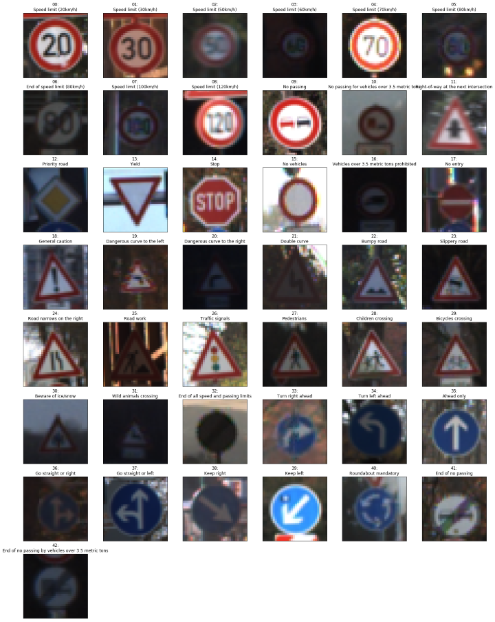

Since they are chosen at random, every run of the relevant block of the notebook would give a different image. Very explorative.

Next, I counted how many of each classes are there in the training, validation, and testing sets. The distribution of the classes are not equal, that is, some classes have more images than the others. However, across the three sets, the distributions are approximately the same; classes that are more represented in the training set are also more represented in the validation and testing sets, with similar proportion. This is best shown in pictures. Here are the class counts in each set:

Training:

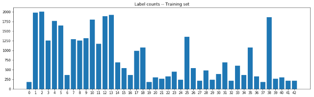

Validation:

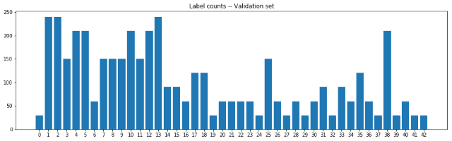

Testing:

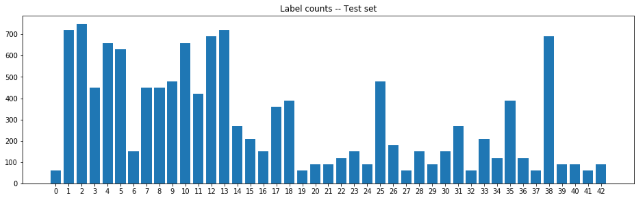

And here are their percentages combined:

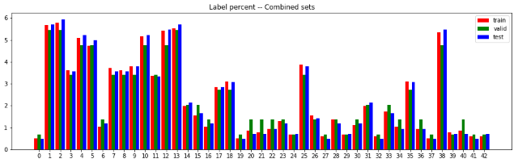

### Design and Test a Model Architecture

#### 1. Preprocessing

First, I converted the image to grayscale, because [sermanet-2011][Sermanet 2011] showed that grayscale input works better for traffic sign classification. This was actually done after some experimentation with colour inputs. More discussion on the *Solution Approach* section.

Grayscale conversion was done with this formula:

```
G = 0.3*R + 0.59*G + 0.11*B
```

This is implemented in the `greyscale` function. Here is an example of a traffic sign image before and after grayscaling.

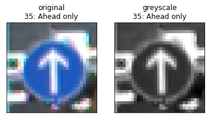

Finally, the dataset is normalised with this equation:

```
X_normal = (X - 128)/128
```

So that the image data are between -1 and 1. This is implemented in the `preproc_quick` function.

#### 2. Model Architecture

My final model consisted of the following layers:

| Layer         		        |     Description	        					| 
|:-------------------------:|:---------------------------------:| 
| Input         		        | 32x32x1 greyscale image   				| 
| conv1: Convolution 5x5  	| 1x1 stride, valid padding, outputs 28x28x16 |
| Relu    					        |		             										|
| Max pooling	              | 2x2 stride, outputs 14x14x16			|
| conv2: Convolution 5x5    | 1x1 stride, valid padding, outputs 10x10x32 |
| Relu                      |                                   |
| Max pooling               | 2x2 stride, outputs 5x5x32        |
| dense0: conv stack        | concatenation of flattened conv1 and conv2 3936 neurons |
| dense1: Fully connected   | 100 neurons |
| Relu                      |             |
| Dropout                   | 0.75 probability to keep neuron output during training  |
| dense2: Fully connected   | 50 neurons  |
| Relu                      |             |
| Dropout                   | 0.75 probability to keep neuron output during training  |
| dense3: output layer      | 43 neurons, also called logits |
| Softmax				            | turns above layer into class probabilities|

Several other models were also tested. Experiment log is included in explog.ods, and some checkpoints are also included in the experiments directory. More on those models in the *Solution Approach* section.

#### 3. Model Training

The loss function of this network is mean of cross-entropy. Training involves using an optimiser to tune the values of network weights and biases such that this loss function is minimised. The optimiser I used was the Adam Optimiser with learning rate 0.001.

Training was done with batches, each containing 128 training data points. The network was trained for 64 epochs. The actual procedure was to train the network for 32 epochs right after creation, save a checkpoint, then continue training for 32 more epochs from that checkpoint. After each set of 32 epochs I plot the validation accuracy. If there seemed to be room for improvement, I ran the training for a few more epochs. The plots from the model architecture described above are as shown:

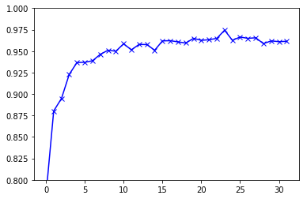 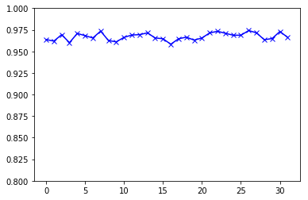

#### 4. Solution Approach

My final model results were:
* training set accuracy of 1.000
* validation set accuracy of 0.966 
* test set accuracy of 0.945

To arrive at the above result, I tried several input (RGB, greyscale), normalisation (quick, xbar, standardisation), and architectures (convolution layer depths, dense layer sizes, extra dense layer). There are 19 experiments, and they are recorded in the explog.ods spreadsheet included with this submission (case14 was missing final accuracy because I accidentally started case15 before noting it down, interested parties can try it for themselves).  

**Input type (RGB, greyscale)**

I started with RGB input as intuitively, the colours of traffic signs would carry relevant information. One of the better result of this approach is case02 with 0.969 validation accuracy. However, because of its use of xbar normalisation, I opted not to submit that model as the final architecture.

Greyscale input was tried as a result of reading [sermanet-2011][Sermanet 2011]. The combination of greyscale preprocessing and multiscale architecture is the final network architecture in this submission.

**Normalisation**

I started with the **xbar normalisation**, done in this formula:

```
X_normal = (X - xbar)/xbar
```

Where `xbar` is the average value of all pixels in all samples in all channels. This was inspired by the example normalisation provided in the project starter, but instead of using 128, I would use the average of the dataset instead (about 82). Indeed, this normalisation is part of the highest accuracy model I experimented with. However, since the `xbar` is calculated over the dataset (as I implemented it, training, validation, and testing data would have their own `xbar`s), doing inference on new data delivered one image at a time would greatly reduce the pixels the `xbar` is calculated from.

This normalisation method is implemented in the `preproc_xbar` method.

Next I tried the **standardisation**. This normalisation method transforms the dataset such that it is centred at 0 and has standard deviation is one. It is calculated with:

```
X_normal = (X - mean(X))/stdev(X)
```

Experiments show that this yields slightly lower accuracy than xbar normal, and has the same problem of needing a dataset to calculate its parameters. Looking ahead a little bit, using normalisation parameters calculated on the training data to normalise new data (such as the extra German signs), would reduce the accuracy (to zero, in the case I tried it).

This normalisation method is implemented in the `preproc` method.

Finally, I used the **quick normalisation** as suggested in the starter package of the project, with:

```
X_normal = (X - 128)/128
```

By using only constants, having the new data points arrive one at a time is not a problem. However, experiments with this normalisation with single-scale models (as opposed to [Sermanet 2011]'s multi-scale), yield the lowest accuracies of all tried single-scale models (see cases 11-13 in the explog.ods).

**Architectures**

Many architecture variations were tried. This involves adding more depths to the convolutional layers, more hidden neurons in the dense layers, adding a third dense layer, and using multi-scale architecture. The main result is so: use greyscale input and multiscale architecture, and the convolutional layers do not need to be very deep.

These architecture are implemented in three network-building functions:

- `network` for 2 convolutional layers and 2 dense layers, single-stage
- `network_md` (md for more dense) for 2 convolutional layers and 3 dense layers, also single-stage
- `network_ms` (ms for multi-scale) for 2 convolutional layers, 2 dense layers, multi-scale

To alter the sizes of the network, change the variables at the top of their respective definitions. To use any of the three, simply change the `logits` assignment to the desired network type. For `network_ms`, care must be taken to harmonise the `x` placeholder and the `grey` parameter when using RGB or greyscale inputs.

Another combination I have not tried is single-scale architecture with greyscale input (I should, but I tried multiscale first and it meets rubric).

#### 5. More Evaluation

I computed a confusion matrix from the validation set. It is shown here:

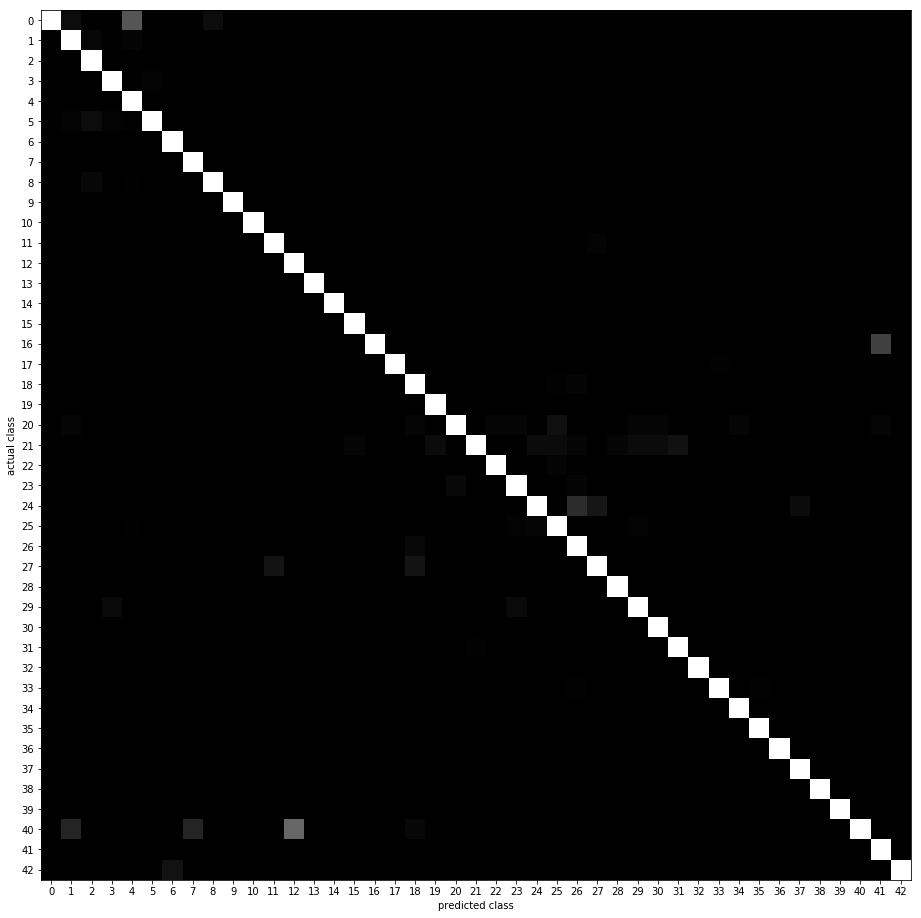

Non-zero off-diagonal elements are instances of misclassifications. A very visible example is *class 40: Roundabout Mandatory* often misclassified as *class 12: Priority Road*. Here are examples of the pair:

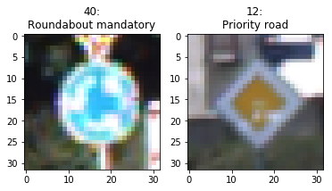

I think this is a case where taking colour into account would help, but just simply adding colour to the current network would not go well, as case18 has shown.

### Test a Model on New Images

#### 1. Acquire new German traffic sign images 

I did a virtual tour of Berlin and Frankfurt and brought home these six signs: (they were resized to 32x32 for experiment, then resized again to 200x200 for display here)

  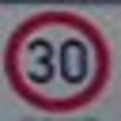 

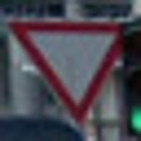  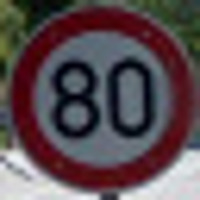

#### 2. Performance on New Images 

Here are the results of the prediction:

| predict | actual |
|:-------:|:------:|
| 17: No entry | 17: No entry |
| 12: Priority road | 12: Priority road |
| 2: Speed limit (50km/h) | 5: Speed limit (80km/h) |
| 38: Keep right | 38: Keep right |
| 13: Yield | 13: Yield |
| 1: Speed limit (30km/h) | 1: Speed limit (30km/h) |

The model was able to correctly guess 5 of the 6 traffic signs, which gives an accuracy of 83.33%. This is lower than the test set accuracy, but there are very few examples here, that saying that it is actually performing worse is premature.

Additionally, the mistake being made was misclassifying a speed limit as another. At best, this would annoy fellow road user, and at worse this would be dangerous.

#### 3. Softmax performance

In this network, it is very confident of its prediction, including the wrong ones! Looking into the top 5 softmax probabilities, they are always very close to 1.0. Here are two examples, one from a correct prediction, and another from a wrong one:

actual: **No entry**

| probability | prediction |
|:-----------:|:----------:|
| 1.0000 | No entry |
| 0.0000 | Stop |
| 0.0000 | Turn right ahead |
| 0.0000 | Speed limit (20km/h) |
| 0.0000 | Speed limit (30km/h) |

actual: **Speed limit (80km/h)**

| probability | prediction |
|:-----------:|:----------:|
| 0.9998 | Speed limit (50km/h) |
| 0.0002 | Speed limit (30km/h) |
| 0.0000 | Speed limit (70km/h) |
| 0.0000 | Speed limit (80km/h) |
| 0.0000 | Speed limit (60km/h) |

### Visualizing the Neural Network
#### 1. Discuss the visual output of your trained network's feature maps. What characteristics did the neural network use to make classifications?

Using the following image as stimulus, 

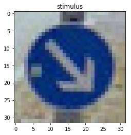

I plotted the response of the two convolutional layers using the function provided in the starter notebook:

First convolutional layer response

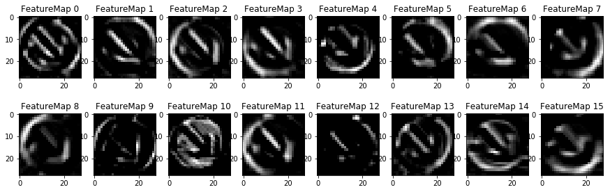

Second convolutional layer response

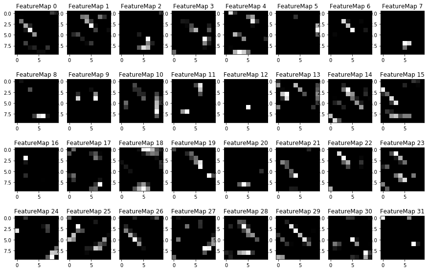

The first convolutional layer seems to show that the network response to edges from various angles and flat colour area (row 2, column 3). The second convolutional layer is harder to read. It seems that the diagonal from the arrow produces strong response in many of the features in the second convolutional layer.
